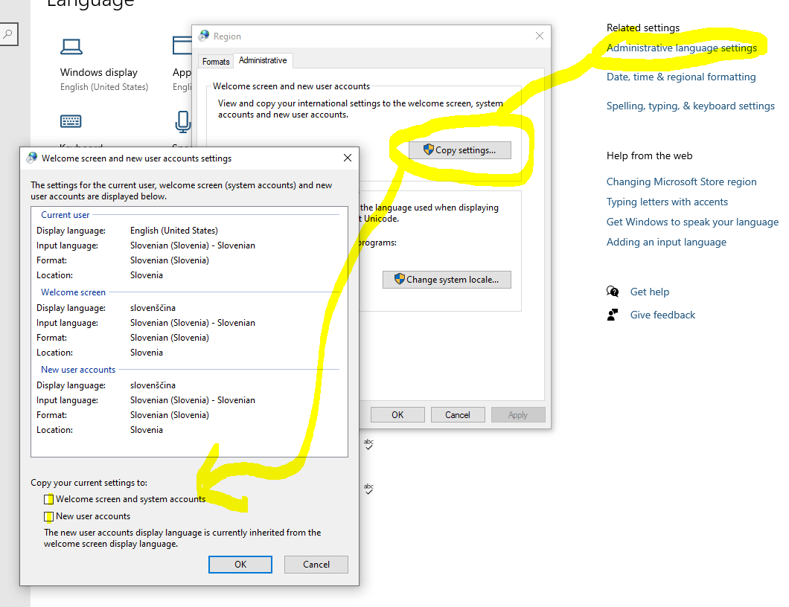

# Windows Setup scripts

A bunch of Powershell scripts to prepare used laptops with preinstalled Windows 10 21H2 for everyday usage.

## Purpose

I prepare laptops for Ukrainian soldiers or refugees occasionally, and those are utility scripts to automate this process.

## Requirements

- Windows 10 21H2+

## Preparations

Firstly, you have to create file `configuration.json`, you can check example below.  
In this example `GeoId` is set to `Ukraine`, `TimeZone` is set to `Kyiv`, and default welcome screen and new user input is set to `Ukrainian (Extended)`.
```json
{
    "SSID": "YOUR_SSID",
    "Password": "Y0UrP@SsWord!",
    
    "PrimaryLanguageCode": "uk-UA",
    "SecondaryLanguages": ["en-US"],
    
    "GeoId": 241, 
    "TimeZone": "FLE Standard Time",

    "PrimaryInputCode": "0422:00020422"
}
```

You can find `GeoId` value for your country [here (decimal values)](https://learn.microsoft.com/en-us/windows/win32/intl/table-of-geographical-locations).  
`TimeZone` can be found [here (column Timezone)](https://learn.microsoft.com/en-us/windows-hardware/manufacture/desktop/default-time-zones?view=windows-11).

### Activation scripts

This is a secret sauce. If you want to automate it, you have to create `apps/office2021/activate.psm1` Powershell module with next content:
```powershell
function Activate-Office2021 {
    # Put your code to activate Office 2021
}
```

## Usage

### Part 1. Windows updates and apps
- Run `setup_1.ps1` (takes around 8 minutes)
- Wait for a restart

### Part 2. Language
- Run `setup_2.ps1` (takes around 8 minutes)
- Wait until `Language settings` are opened
- Open `Administrative language settings`
- `Copy settings`
- Tick both `Welcome screen and system accounts` and `New user accounts`
- Restart laptop



### Part 3. Manual Job
- Check Languages settings, Region, TimeZone
- Check if any Office 2021 app is activated (if needed)

## What scripts do

### setup_1.ps1
- Import `configuration.json`
- Connect to Wi-Fi
- Wait for internet availability
- Install Windows Updates, if possible
- Install Chrome
- Install Office 2021 Basic (Word, Excel, PowerPoint) with language set in configuration
- Activate Office 2021, if possible
- Restart to install updates

### setup_2.ps1
- Install language pack for primary language
- Install secondary languages
- Remove other languages
- Set default timezone
- Set default region

### info.ps1
Utility script for laptop information

## TODO
- Add support for `Copy internation settings to the welcome screen, system accounts and new user accounts` for Windows 10
- Add support for Windows 11
- Test on earlier Windows 10 versions (2016 and earlier)
- Fix `info.ps1`
